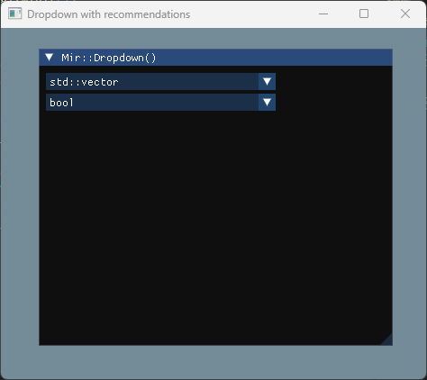

## Dropdown with recommendations
A searchable dropdown/combo box that allows filtering options as you type. Implemented using Dear ImGui.
### Why? - I Couldn't find one.


### Code Example 
```cpp
void ImguiManager::Render() {
    static const std::vector<std::string> dataTypeOptions = {
        "int", "float", "double", "char", "bool", "string",

        "int8_t", "uint8_t", "int16_t", "uint16_t", "int32_t", "uint32_t", "int64_t", "uint64_t",

        "std::vector", "std::array", "std::list", "std::map", "std::set", "std::unordered_map", 

        "std::unique_ptr", "std::shared_ptr", "std::weak_ptr",

        "std::string", "std::string_view", "std::filesystem::path",

        "MyCustomClass", "ApplicationSettings", "UserProfile"
    };
    static std::string str = "Hello world";
    static std::string str2 = "Hello world2";

    ImGui::Begin("Mir::Dropdown()");
    Mir::Dropdown(str, "id1", dataTypeOptions);
    Mir::Dropdown(str2, "id2", dataTypeOptions);
    ImGui::End();
};
```


### TODOs
- None.
- Tool for myself and currently does what i wants.

# Building
Dependencies:
- **Windows** - For WindowsFileDialog.cpp
- **Dear ImGui** - For Main functionality
- **GLFW** - for ImGui backend
- **OpenGL** - for ImGUi backend
- **C++23** - for std::string.contains()

### Building with CMake

1. Clone the repository:
   ```bash
   git clone https://github.com/Mairooriam/Dropdown.git
   cd Dropdown
   ```

2. Create a build directory:
   ```bash
   mkdir build
   cd build
   ```

3. Configure the project:
   ```bash
   cmake ..
   ```

4. Build the project:
   ```bash
   cmake --build . --config Release
   ```

5. Run the example:
   ```bash
   ./Mir/dropdown
   ```

## Licenses

This project is licensed under the MIT License - see the [LICENSE.txt](LICENSE.txt) file for details.

### Third-Party Libraries

This project uses the following third-party libraries:

* **Dear ImGui** - MIT License - [View License](Resources/Licenses/imgui-LICENSE.txt)
* **GLFW** - zlib/libpng License - [View License](Resources/Licenses/glfw-LICENSE.txt)

